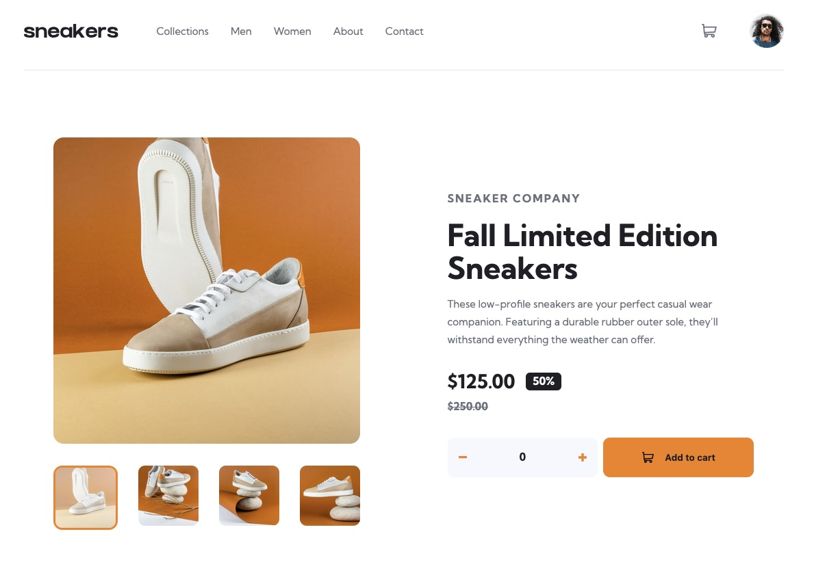

# Frontend Mentor - E-commerce product page solution

This is a solution to the [E-commerce product page challenge on Frontend Mentor](https://www.frontendmentor.io/challenges/ecommerce-product-page-UPsZ9MJp6). Frontend Mentor challenges help you improve your coding skills by building realistic projects.

## Table of contents

- [Overview](#overview)
  - [The challenge](#the-challenge)
  - [Screenshot](#screenshot)
  - [Links](#links)
- [My process](#my-process)
  - [Built with](#built-with)
  - [What I learned](#what-i-learned)
  - [Useful resources](#useful-resources)
- [Author](#author)

## Overview

### The challenge

Users should be able to:

- View the optimal layout for the site depending on their device's screen size
- See hover states for all interactive elements on the page
- Open a lightbox gallery by clicking on the large product image
- Switch the large product image by clicking on the small thumbnail images
- Add items to the cart
- View the cart and remove items from it

### Screenshot

### Links

- Solution URL: [Solution](https://github.com/vince4dev/challenge19)
- Live Site URL: [Live site](https://vince4dev.github.io/challenge19/)

## My process

### Built with

- Semantic HTML5 markup
- CSS custom properties
- Flexbox
- CSS Grid
- Mobile-first workflow
- Javascript

### What I learned

JavaScript — Interactivity

- Image gallery: Previous/next navigation with circular looping (modulo operator), thumbnail selection.
- Modal / Lightbox: Open/close using `classList.toggle("active")`, scroll locking (`body.style.overflow = "hidden"`), close on overlay click.
- Keyboard navigation: `keydown` listeners for ←/→ arrows within the modal, Escape to close, Enter/Space to open.
- Quantity selector: +/- buttons with a minimum limit of 0.
- Shopping cart: Dynamic badge, add/remove items, "empty" message, close popover on outside click.
- Mobile menu: Slide-in effect with class toggling on the menu and overlay.
- Dynamic rendering: Thumbnails generated via JS using `innerHTML` and template literals, followed by event attachment.

### Useful resources

- [google-webfonts-helper](https://gwfh.mranftl.com/fonts) - This helped me find the font and integrate it into the project.
- [MDN](https://developer.mozilla.org/fr/) - Resources for Developers.

## Author

- Frontend Mentor - [@vince4dev](https://www.frontendmentor.io/profile/vince4dev)
